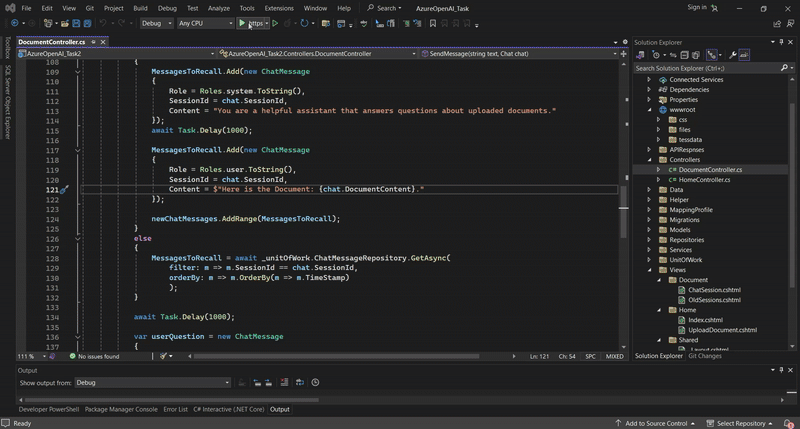
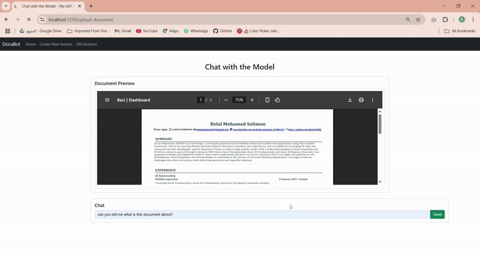
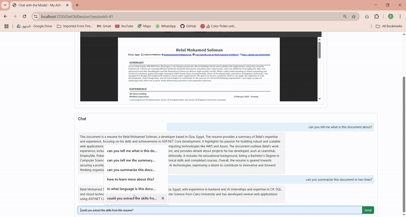
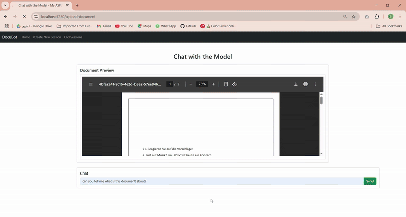

# 🧠 AI-Powered Document Understanding with Azure OpenAI + ASP.NET Core MVC

A web application that enables users to upload documents (like CVs, reports, or articles) and engage in intelligent, context-aware conversations with the content using **Azure OpenAI GPT-4o** and **ASP.NET Core MVC**.

---

## 🚀 Features

- **📄 Document Upload:** Upload PDFs through a user-friendly UI.
- **🧾 Text Extraction:** Extracts raw text from PDFs using the `iText` library (required since GPT only processes text).
- **💬 Chat with Your Docs:** Sends both the extracted text and user prompts to **Azure OpenAI Chat Completion (GPT-4o)** for responses.
- **📚 Chat Memory:** Stores messages (user & AI) in a relational structure: each conversation belongs to a **Session** with multiple **Messages**.
- **🗂 Session Management:**
  - Start a new session with a fresh document.
  - Resume previous sessions with full conversation history.

---

## 🏗️ Tech Stack

- ASP.NET Core MVC (.NET 8)
- Azure OpenAI Service (GPT-4o)
- iText 7 (for PDF text extraction)
- Entity Framework Core (for session/message persistence)
- Bootstrap (for front-end UI)

---

## 🔁 How It Works

1. **Upload a Document**
2. **Text is extracted** and sent to GPT-4o along with your question
3. **Response is displayed** in a conversation-like interface
4. **Session is saved** — you can return to it later!

---

## 🧠 Real-World Scenarios

**CV Review Assistant**
- “What skills are highlighted in this resume?”
- “What improvements can I make to tailor it for a software engineering role?”

**Report Summarizer**
- “Summarize this document in 5 bullet points.”
- “What are the key insights mentioned?”
- “Does this report mention project deadlines?”

**Use Cases:**
- Personal AI Assistant
- HR/Recruitment tools
- Academic document analysis
- Business intelligence reports

---

## ⚙️ Getting Started

Follow these steps to set up and run the project locally.

### ✅ Prerequisites

Before you begin, make sure you have the following installed:

- [.NET SDK 8.0+](https://dotnet.microsoft.com/en-us/download/dotnet/8.0)
- An Azure OpenAI resource (with access to GPT-4o)
- API credentials: Add your Azure OpenAI `endpoint`, `API key`, and `deployment ID or Name` to the `appsettings.json` file like so:

```json
{
  "AzureOpenAI": {
    "Endpoint": "https://<your-resource-name>.openai.azure.com/",
    "ApiKey": "your-api-key",
    "DeploymentName": "gpt-4o"
  }
}```


---


# 🛠️ Setup Instructions
Run the following commands to get started:

## 1. Clone the repository
git clone https://github.com/belal442002/DocuBot.git

## 2. Navigate into the project folder
cd AzureOpenAI-Task

## 3. Restore project dependencies
dotnet restore

## 4. Apply Entity Framework migrations (if database is used)
dotnet ef database update

## 5. Run the application
dotnet run

---

## 📷 GIF 

### ▶️ Part 1


### ▶️ Part 2


### ▶️ Part 3


### ▶️ Part 4


## 📽️ Full Demo Video (Google Drive)

If you'd prefer to watch the entire 2-minute demo as a single video, you can view it on Google Drive:

👉 [Watch Full Demo on Google Drive](https://drive.google.com/file/d/1srJNKFNtbEjtw2s63bzxo9aXySW3Yt9l/view?usp=sharing)


